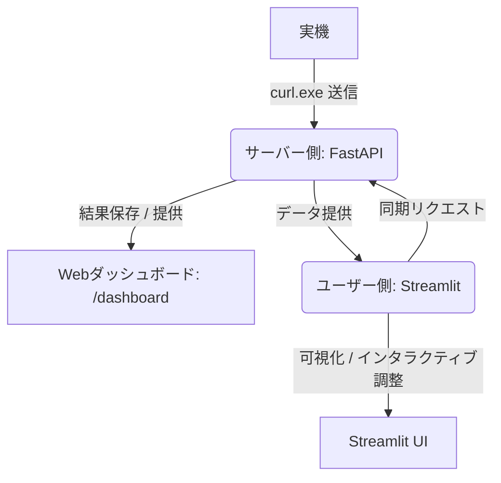

# モーター制御（PID）調整・解析システム

本プロジェクトは、左右モーターのPIDゲイン調整、速度応答解析、および走行データの可視化を強力にサポートするシステムです。
実機やシミュレータからのCSVログデータを解析し、制御評価スコアの算出や、最適なPIDゲイン調整への自動アドバイスを行います。

システムは **サーバー側 (FastAPI)** と **ユーザー側 (Streamlit)** の二層構造で構成されており、インタラクティブな波形解析から、実機の走行ログ自動送信・可視化パイプラインまで統合的にカバーしています。

---

## 構成概要



### 1. サーバー側 (FastAPI)
- **ファイル**: [api.py](./src/server/api.py), [analyzer.py](./src/analyzer.py)
- **役割**: CSVファイルを受け取り、バックエンドで高速解析を実行、結果を `analysis_results/` ディレクトリに保存します。
- **エンドポイント**:
  - `POST /analyze`: CSVログとパラメータを受け取り、解析結果をJSONで返します。
  - `GET /dashboard`: 解析結果の推移を一覧表示するリアルタイムダッシュボード（HTML形式）を提供します。
  - `GET /results`: 過去の解析結果リストを取得します。

### 2. ユーザー側 (Streamlit)
- **ファイル**: [app.py](./src/app.py), [analyzer.py](./src/analyzer.py)
- **役割**: 解析データおよびゲイン調整のためのグラフィカルな対話インターフェースを提供します。
- **特徴**:
  - **ローカルCSV読み込み**: 手元にあるCSVファイルをドラッグ＆ドロップして即座に解析できます。
  - **サーバー同期モード**: サーバー側 (FastAPI) に蓄積された過去の測定ログを選択し、ターゲット値やPIDゲイン設定（Kp, Ki, Kd）を自動同期して解析・可視化できます。

---

## 環境構築

uv を用いた環境を構築します。

1. uv をインストール（既にインストールしている人はスキップ）

   ```
   # macOS/Linux
   curl -LsSf https://astral.sh/uv/install.sh | sh

   # Windows(PowerShell)
   powershell -ExecutionPolicy ByPass -c "irm https://astral.sh/uv/install.ps1 | iex"
   ```

   pip 環境があれば、pip からもインストールでまきす。  
   Homebrew でもできます。
   ```
   # pip
   pip install uv

   # Homebrew
   brew install uv
   ```


1. python 3.12 を uv 上にインストール

   ```
   uv python install 3.12
   ```

   `uv python list` でインストールした python のバージョンを確認できます。

1. 仮想環境を構築およびアクティベート

   ```
   uv venv　# 仮想環境を構築
   source .venv/bin/activate　# 仮想環境をアクティベート
   ```

   ターミナルのユーザの左に (pid_adjust) という表記が出ていれば、仮想環境のアクティベート成功。

1. 依存関係の同期

   ```
   uv sync
   ```

  　このコマンドで必要なパッケージを全て新ストールすることができます。
   `uv pip list` でインストールしているパッケージの確認ができます。

---

## 起動と使用方法

＊ サーバー側/ユーザー側問わず、起動の際は、仮想環境をアクティベートする必要があります。
```
source .venv/bin/activate
```

### A. サーバー側 (FastAPI) の起動

```powershell
uv run -m src.server.api 
```
- サーバーが `http://localhost:8000` で起動します。
- ブラウザで `http://localhost:8000/dashboard` を開くと、送信されたデータ履歴とスコア推移をグラフィカルに確認できます。

### B. ユーザー側 (Streamlit) の起動

```powershell
streamlit run app.py
```
- ブラウザが起動し、`http://localhost:8501` に接続されます（初回起動時にEmail入力を求められた場合は、何も入力せずEnterを押してください）。

#### 使用モード
1. **ローカルCSVファイルをアップロード**:
   画面からCSVファイルをアップロードし、左側のサイドバーでターゲット値・ゲインを設定して解析します。
2. **サーバーと同期（最新データ）**:
   FastAPIサーバーと同期し、サーバー上に保存されている過去の測定履歴から選択して、当時のゲイン・ターゲット値等をワンクリックで復元・解析・可視化します。

### 実機側からの送信
実機の測定が完了した際、以下のコマンドを実行してCSVログをサーバーへ即座に送信・解析させることができます。
```
curl -X POST -F "file=@runlog.csv" http://localhost:8000/analyze
```

*(※ PowerShell を使用する場合は、PowerShellのデフォルトの `curl` はエイリアスになっているため、必ず `curl.exe` と明記して呼び出してください。)*
```powershell
curl.exe -X POST -F "file=@runlog.csv" http://localhost:8000/analyze
```

ターゲット値などのパラメータを指定して送信することも可能です。
```
curl -X POST -F "file=@runlog.csv" -F "target_val=600" -F "kp_l=1.2" http://localhost:8000/analyze
```

---

## CSVファイル形式

解析対象のCSVファイルは、以下のカラムを含んでいる必要があります。

| カラム名 | 意味 |
| :--- | :--- |
| `time` | 時間軸（秒） |
| `leftSpeed` | 左モーターの実測速度 |
| `rightSpeed` | 右モーターの実測速度 |
| `leftPower` | 左モーターの制御出力値 |
| `rightPower` | 右モーターの制御出力値 |

**CSVファイルの記述例:**
```csv
time,leftSpeed,rightSpeed,leftPower,rightPower
0.0,0.0,0.0,0.0,0.0
0.1,50.2,49.8,25.5,24.8
0.2,100.5,101.2,51.0,50.5
...
```

---

## UV の使い方

UV を用いた開発の進め方を軽く説明します。

### 作業時に行うこと

1. 仮想環境のアクティベート

   作業を始める際や、シェルを新しくした場合に仮想環境をアクティブ化する必要があります。

   以下のコマンドで、仮想環境をアクティベートします。

   ```
   source .venv/bin/activate
   ```

   VS Code などのエディタを使う場合、エディタさんが仮想環境を自動検出し、勝手にアクティブにしてくれる場合もあります。

1. 依存関係の同期

   依存関係に変更があった場合、以下のコマンドで、パッケージの依存関係を最新に同期します。

   ```
   uv sync
   ```

### パッケージの追加

1. 以下のコマンドでパッケージを追加

   ```
   uv add [パッケージ名]
   ```

   これを行うと、`pyproject.toml` と `uv.lock` が変更されます。

1. パッケージを追加して問題なければ、変更された`pyproject.toml` と `uv.lock` をプッシュ。

1. 他端末は `pyproject.toml` と `uv.lock` の変更をプルして、以下のコマンドでパッケージ環境を同期

   ```
   uv sync
   ```

### パッケージの削除

以下のコマンドでパッケージを削除できます。

```
uv remove [パッケージ名]
```

もし、すでに github にプッシュ済みのパッケージを消去したのならば、`pyproject.toml` と `uv.lock` の変更をプッシュします。

他端末での環境の同期はパッケージの追加の時と同じです。
